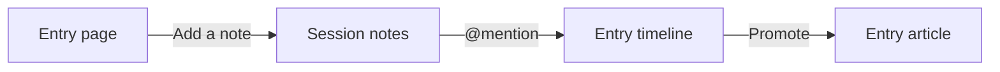

# TakeInitiative v2 — Handoff

_As of 2026-09-25._

## Where things stand

The v2 design is agreed and merged to `dev` (PR #192, merge `478c3af`). No v2
code exists yet, so the next piece of work is step 13.

| Stage | State |
| --- | --- |
| 1 — Get running (steps 01–07) | Done. `pnpm install && pnpm dev` works from a clean clone |
| 2 — Replace dice roller (08–11) | Done. `packages/TakeInitiative.Dice` replaces Python |
| 3 — v2 design (12) | Done. Merged in #192 |
| 3 — v2 build (13–19 MVP, 20–24 post-MVP) | Not started. No step files written yet |

Open these at the start of every session:

- [`README.md`](README.md): status of every step and the house rules
- [`12-v2-design-session.md`](12-v2-design-session.md): the design. The glossary (§1) and invariants (§10) are binding

## Decisions to carry

v2 is rebuilt from scratch and starts with no data. It is player-first, built
around four experiences: combat, note taking, ⌘K search and connections.

Notes are posted at a point in a session, and `@` mentions integrate them into
the wiki.

**Glossary words most likely to be got wrong:**

| Use | Never |
| --- | --- |
| Session note (code: `SessionNote`) | message, post, journal |
| Entry, Kind, Article | entity, type, description |
| Campaign tab | journal, channel |
| Connection (evidence snippets) | relation, edge |
| Member (role DM or Player) | player, when it means a user |
| Combatant | staged, initiative or planned character |

**Invariants every step must respect:**

1. The glossary is law. A new noun is added to it before it appears in code.
2. Every session note and every combat belongs to exactly one session. The
   current session is the latest one.
3. Only a note's author edits it. Entries follow their edit access, and DMs can
   always edit.
4. Visibility (Everyone, DM, Me) is enforced on the server for every read and
   every SignalR push. Nothing is revealed automatically.
5. Mentions are stored by entry id, so renames and merges never rewrite text.
6. Every event carries an Actor, and correlation metadata is on from day one.
7. No paid services. Mobile is first-class: every command has a touch control.

## Next steps

Step 13 (the v2 skeleton) comes next. Each step file is written just before its
step starts, not ahead of time.

| # | Step | Depends on | Goal |
| --- | --- | --- | --- |
| 13 | v2 skeleton | 12 | New branch. Campaign, members and roles, auth, OpenAPI type generation, PWA shell with three tabs |
| 14 | Sessions + session notes | 13 | Composer, markdown, visibility, filters, back-posting, gap prompt, live over SignalR |
| 15 | Wiki + mentions | 14 | `@` composer, entries, articles, timeline, promote, secret blocks, aliases, merge, edit access |
| 16 | Images | 14 | S3 blob store (MinIO in dev), image notes, captions, galleries, share target |
| 17 | ⌘K search | 15 | Postgres FTS plus trigram, visibility-aware, actions |
| 18 | Combat v2 | 15 | 7 events, one Combatant, per-combatant PlayersSee, server-side redaction |
| 19 | Connections + loose ends | 15, 18 | Evidence panel, graph page, loose ends in the wiki and on sessions |

The MVP ends at step 19. After that, in order:

- **20:** SRD reference
- **21:** 5eTools search index
- **22:** D&D Beyond link
- **23:** In-browser suggestions (GLiNER vs Laya)
- **24:** Discord import

Steps 16, 17 and 18 only depend on 14 or 15, so they can be built in any order
once 15 lands.

## Step 13 kickoff

Start by writing `docs/roadmap/13-v2-skeleton.md` in the house format: Goal,
Depends on, Files touched, Steps, Verify, and Notes / gotchas.

> **Decide first:** grow v2 on a long-lived `v2` branch cut from `dev` (v1 left
> untouched on `dev`), or build it as new projects next to v1 on `dev`? The
> checklist below assumes the `v2` branch.

- [ ] Write the step file and add its link in the README table
- [ ] Cut the `v2` branch from `dev`
- [ ] API: add a Campaign stream (created, member joined, role changed) with
      inline projections and Marten correlation, causation and header metadata on
- [ ] API: add an `Actor { MemberId }` on every event and a join code. Membership
      is stored once, not in three places
- [ ] Auth: carry over the existing Marten Identity setup, minus the v1
      `ApplicationUser.Campaigns` list
- [ ] Generate the web types from the API's OpenAPI document, replacing the
      hand-written Zod models
- [ ] Web: PWA shell using Ripple's `@vite-pwa/nuxt` config, with Campaign, Wiki
      and Combat tabs and a search button, all empty
- [ ] Verify: sign up, create a campaign, join it from a second account, see both
      members in the Campaign tab on a phone-sized screen, and install the PWA

The exit bar comes from the roadmap rule: the step ends runnable, and `pnpm dev`
works from a clean clone.

## Gotchas and v1 carry-over

Only a few things survive from v1. The rest is reference material to read and
then delete.

| v1 thing | Fate in v2 |
| --- | --- |
| `packages/TakeInitiative.Dice` | Keep as-is. Used for initiative and HP rolls |
| `CombatHub` and `setCombatQueryData` pattern | Keep the pattern, but redact on the server before sending |
| Combat integration tests (`FullCombatTest` and others) | Use as behaviour reference, rewrite for the 7-event model |
| `utils/types/models.ts` (433 hand-written Zod schemas) | Delete. Replaced by generated OpenAPI types |
| `PlannedCombat`, stages, five character records, History list | Delete. Replaced by Draft combats and one Combatant |
| `Campaign.ActiveCombatId` | Delete. Several combats can run at once |
| Bestiary branches (3, unmerged) | Mine for parsing in step 21, then delete |

- **Commit scopes:** the husky hook only accepts `api`, `web`, `identity`,
  `dice`, `root`, `ci` and `docs`. `docs(roadmap)` is rejected.
- **Hidden combatants:** v1 leaks hidden NPCs because it filters them in the
  browser. Don't port that.
- **Paused state:** v1 checks for it in about 7 commands but can never reach it.
  Don't port that either.
- **D&D Beyond refresh:** relies on an undocumented endpoint and only works for
  public sheets. It must fail gracefully.
- **5eTools:** search index only, never displayed, and the index is not
  committed.
